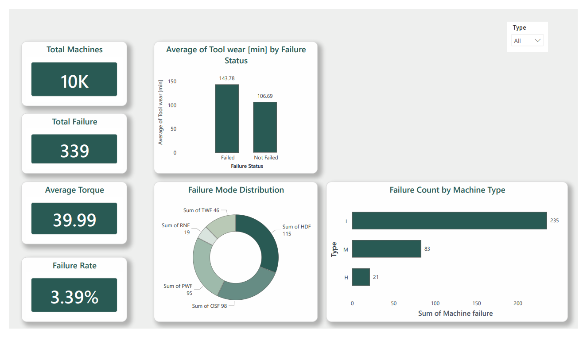

#  Predictive Maintenance Analysis

An end-to-end data analytics project that analyzes industrial machine performance and predicts machine failures using the AI4I 2020 Predictive Maintenance dataset.

The project combines **SQL**, **Python**, **Power BI**, and **Machine Learning** to identify failure patterns, analyze machine health, and generate actionable insights for predictive maintenance.

##  Business Problem

Unexpected machine failures increase maintenance costs, reduce production efficiency, and cause unplanned downtime.

This project analyzes machine sensor data to identify failure patterns and support predictive maintenance strategies that help industries schedule maintenance before failures occur.

---

##  Project Objectives

- Analyze industrial machine operational data.
- Perform SQL-based data cleaning and exploratory analysis.
- Build an interactive Power BI dashboard.
- Identify factors contributing to machine failures.
- Perform data analysis using Python.
- Develop a machine learning model to predict machine failures. *(In Progress)*
- Build an AI Copilot for intelligent maintenance insights. *(Planned)*

##  Tech Stack

### Languages & Tools

| Category | Technologies |
|----------|--------------|
| Programming | Python, SQL |
| Database | PostgreSQL |
| Data Analysis | Pandas, NumPy, Matplotlib |
| Visualization | Power BI |
| Version Control | Git, GitHub |
| IDE | VS Code, Jupyter Notebook |

##  Dataset

**Dataset:** AI4I 2020 Predictive Maintenance Dataset

The dataset contains simulated industrial machine data used to analyze machine health and predict failures.

### Features

- Machine Type
- Air Temperature
- Process Temperature
- Rotational Speed (RPM)
- Torque
- Tool Wear
- Machine Failure
- Failure Types

##  Project Workflow

1. Data Collection
2. Data Cleaning using SQL
3. Exploratory Data Analysis
4. Interactive Power BI Dashboard
5. Python Data Analysis *(In Progress)*
6. Machine Learning Model *(Planned)*
7. AI Copilot *(Planned)*

##  Dashboard Preview

### Executive Dashboard

The interactive Power BI dashboard provides insights into:

- Overall machine failure rate
- Machine type distribution
- Failure type analysis
- RPM, Torque, and Tool Wear trends
- Interactive filtering for detailed analysis
